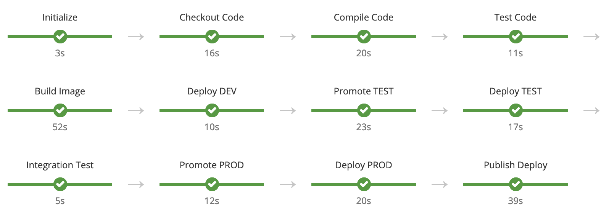

# OpenShift CI/CD Demo

Basic demonstration of OpenShift CI/CD pipelines for deploying applications accross environments using advanced deployment strategies like Blue/Green.

## Pipeline

## Usage

The templates provided (Java and Node.js) are used to create pipelines which in turn creates the application itself based on some parameters like the base image to execute a S2I strategy, the binary artifacts to upload into the S2I process among others.

### Create the templates

The templates could be created in the **openshift** project.

    oc create -f templates/java-pipeline.yaml -n openshift
    oc create -f templates/node-pipeline.yaml -n openshift

### Create the environments (projects)

These are the environments where the applications will be promoted by the pipeline.

For this demonstration the application [hello-thorntail](https://github.com/leandroberetta/hello-thorntail) will be used as an example.

    oc new-project hello-thorntail-dev
    oc new-project hello-thorntail-test
    oc new-project hello-thorntail-prod
    
### Create a Jenkins instance

A Jenkins instances will be created in the development project.

    oc new-app --template=jenkins-ephemeral --name=jenkins -n hello-thorntail-dev

Then a set of permissions need to be granted

    oc adm policy add-role-to-user edit system:serviceaccount:hello-thorntail-dev:jenkins -n hello-thorntail-test
    oc adm policy add-role-to-user edit system:serviceaccount:hello-thorntail-dev:jenkins -n hello-thorntail-prod

### Create the pipeline

The next step is create the pipeline based on the templates (in this case the Java template will be used). This could be done in the OpenShift Web Console in the catalog.

    oc new-app --template java-pipeline -p PARAM_GIT_REPO=https://github.com/leandroberetta/hello-thorntail.git -p PARAM_GIT_BRANCH=master -p PARAM_APP=hello-thorntail -n hello-thorntail-dev

### Start the pipeline

Finally the pipeline is started.  

    oc start-build hello-thorntail-pipeline -n hello-thorntail-dev

